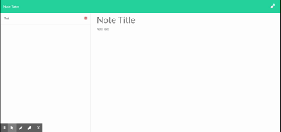

# Unit 11 Express Homework: Note Taker

#  

### Table of Contents
**[Description](##description)** 
**[Installation Instructions](#installation-instructions)** 
**[Usage Instructions](#usage-instructions)** 
**[License](#license)** 
**[Contributing](#contributing)** 
**[Questions](#questions)** 

## Description
For users that need to keep track of a lot of information, it's easy to forget or be unable to recall something important. Being able to take persistent notes allows users to have written information available when needed.This application allows the user to create, read, update, and delete online notes! It uses an express backend and writes to a JSON file.

## Installation Instructions
If you want to run this locally, make sure you have node installed. Clone the repository and run the command npm install. The data is saved under /db/db.json Then run the command npm start to run the application.

## Usage Instructions

This application is deployed at https://notetakermorales.herokuapp.com/notes
Here is a gif showing how to use the app. 

## License

MIT 

Copyright 2020 Aminadab Morales

Permission is hereby granted, free of charge, to any person obtaining a copy of this software and associated documentation files (the "Software"), to deal in the Software without restriction, including without limitation the rights to use, copy, modify, merge, publish, distribute, sublicense, and/or sell copies of the Software, and to permit persons to whom the Software is furnished to do so, subject to the following conditions:

The above copyright notice and this permission notice shall be included in all copies or substantial portions of the Software.

THE SOFTWARE IS PROVIDED "AS IS", WITHOUT WARRANTY OF ANY KIND, EXPRESS OR IMPLIED, INCLUDING BUT NOT LIMITED TO THE WARRANTIES OF MERCHANTABILITY, FITNESS FOR A PARTICULAR PURPOSE AND NONINFRINGEMENT. IN NO EVENT SHALL THE AUTHORS OR COPYRIGHT HOLDERS BE LIABLE FOR ANY CLAIM, DAMAGES OR OTHER LIABILITY, WHETHER IN AN ACTION OF CONTRACT, TORT OR OTHERWISE, ARISING FROM, OUT OF OR IN CONNECTION WITH THE SOFTWARE OR THE USE OR OTHER DEALINGS IN THE SOFTWARE.

## Contributing
Contributors include Aminadab Morales

## Questions
Contact me at https://www.github.com/aminadabm93
https://www.linkedin.com/in/aminadab-morales
